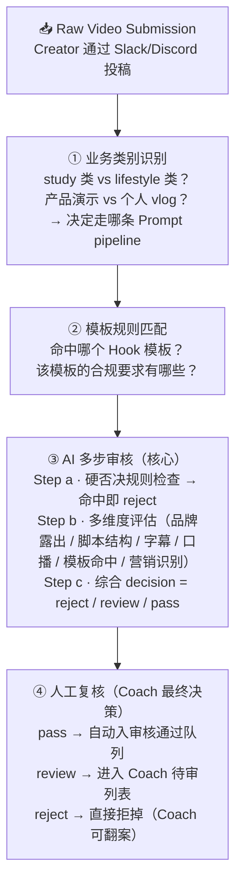

# 02 · System Design · 多步审核链路

## 🏗️ Pipeline Architecture

## 🎯 视频类型 × 评估维度矩阵

不同视频类型的评估维度有差异——这是为什么需要**按类型分类的 Prompt 体系**：

|   维度 \ 类型      | 类型 A | 类型 B | 类型 C | 类型 D |
|-------------------|:----:|:----:|:----:|:----:|
| 品牌露出           |  ✅  |  ✅  |  ⚠️  |  ✅  |
| 脚本结构           |  ✅  |  ✅  |  ✅  |  ⚠️  |
| 字幕完整性         |  ✅  |  ✅  |  ✅  |  ✅  |
| 口播准确性         |  ✅  |  ⚠️  |  ✅  |  ✅  |
| 模板命中度         |  ✅  |  ⚠️  |  ✅  |  ❌  |
| 强弱营销识别       |  ⚠️  |  ✅  |  ⚠️  |  ✅  |

（✅ = 必查 · ⚠️ = 部分查 · ❌ = 不适用）

> 具体类型 A/B/C/D 对应什么视频形式 + 完整规则未公开。

## 🛡️ 硬否决规则（一套客观清单）

所有视频先过这套规则，**命中任一条直接 reject**——把 AI 的主观判断空间压到最小：

- AI 生成的视频
- 时长过短
- 无人脸 + 无产品出镜
- 纯屏幕录制
- 搬运他人视频
- 非英语 + 无字幕
- 音频不可用

> 这是把主观判断前置成客观过滤的关键一步。

## 🔄 Why Multi-step Beats Single-step

| 单步评分 | 多步审核 |
|---------|---------|
| 一次 prompt 让 AI "判断类型+各维度+决策" → 容易混乱 | 每一步只问 AI 一件事 → 输出稳定 |
| 输出难以解释 | 每一步有明确的中间结果 |
| 错了就全错 | 某一步错了，可以单独 review/fix 那一步 |
| 维度间互相干扰 | 维度之间独立判断，避免污染 |

详细的反幻觉策略见 [03-anti-hallucination.md](03-anti-hallucination.md)

---

[← Back to README](../README.md)
